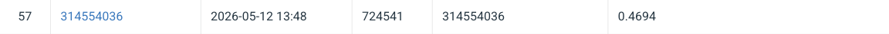

# NYCU Computer Vision 2026 HW3
- Student ID: 313551003
- Name: 馬停偉

## Introduction
This homework tackles Instance Segmentation on colored medical cell images. The goal is to predict per-instance segmentation masks for four cell types (class1–class4) and maximize AP50 on CodaBench.
The model used is Mask R-CNN [1] with a ResNet-50 FPN v2 backbone. Mask R-CNN extends Faster R-CNN by adding a mask branch that predicts binary masks for each detected instance, running in parallel with the box and class branches.

## Enviroment Setup

```
pip install -r requirements.txt
```

## Usage

1. Training and auto testing
```
python train.py --data_root data --output_dir output/ \
    --epochs 100 --lr 1e-4 --all_data \
    --num_workers 2
```

2. Inference
```
python inference.py \
    --test_dir data/test_release \
    --id_map test_image_name_to_ids.json \
    --checkpoint output/model_best.pth \
    --output test-results.json \
    --score_thresh 0.03 \
    --tta
```

## Performance Snapshot

